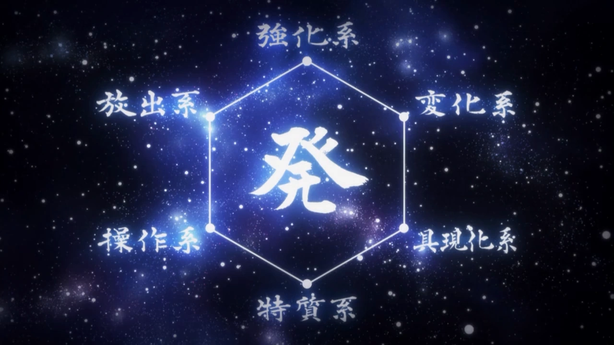
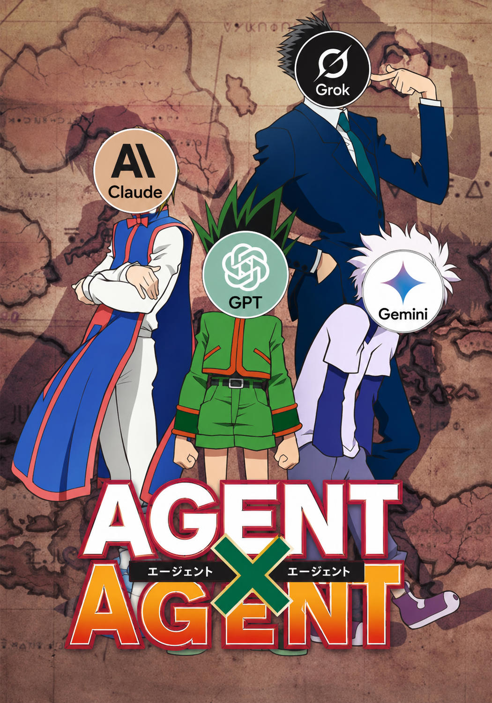

# nen

Skill packs that give an AI coding agent a discipline — six abilities, one per Nen category, and a seventh at the center.



<table>
  <tr>
    <td width="50%"></td>
    <td width="50%"></td>
  </tr>
  <tr>
    <td width="50%"></td>
    <td width="50%"></td>
  </tr>
</table>

<br>

## What this is

In *Hunter x Hunter*, every fighter's aura falls into one of six Nen categories, and mastery means knowing which category a problem belongs to. **nen** maps those six categories to six engineering disciplines and ships each one as an installable agent skill: a stance, a method, hard boundaries, and a worked trace that shows the discipline actually being applied.

nen ships **skills only** — no runtime, no hooks, no MCP servers. Each skill is a single portable `SKILL.md` that any agent can read: Claude Code, Codex CLI, Cursor, OpenCode, Gemini CLI, Qwen Code, Kimi CLI, Antigravity, Pi, GitHub Copilot, or anything with an `AGENTS.md`-style instructions file. One skill text, every runtime.

<br>

## The six categories

| Category | Discipline | Skill | Invocation |
|---|---|---|---|
| Enhancement 強化系 | Profiling-first performance engineering — baseline, profile, change one thing, re-measure | [enhancer](skills/enhancer/) | `/nen:enhancer` |
| Transmutation 変化系 | Behavior-preserving refactoring under characterization tests, plus severity-rated code review | [transmuter](skills/transmuter/) | `/nen:transmuter` |
| Emission 放出系 | Launch, positioning, and promotion — making finished work land with the audience that should care | [emitter](skills/emitter/) | `/nen:emitter` |
| Specialization 特質系 | Reverse engineering and mechanism-comparison research — when the docs run out, read the artifact | [specialist](skills/specialist/) | `/nen:specialist` |
| Conjuration 具現化系 | Failure-mode-driven reliability engineering — enumerate how it breaks, prove every handler with a test | [conjurer](skills/conjurer/) | `/nen:conjurer` |
| Manipulation 操作系 | Orchestration for multi-agent and deep-research work — decomposition, routing, verified delegation | [manipulator](skills/manipulator/) | `/nen:manipulator` |

The skills know about each other. Each one's **Boundaries** section names the sibling disciplines it hands off to — enhancer locks in the benchmark and hands the restructuring to transmuter; specialist decodes the mechanism before conjurer enumerates how it fails. The hand-off graph is enforced by the lint, not left to prose.

### The center of the hexagon

発 — Hatsu. In the source material it is the personal expression of Nen: the ability you forge for yourself, sharpened by self-imposed restrictions. Here it is the seventh skill, [hatsu](skills/hatsu/) (`/nen:hatsu`) — the meta-discipline of forging **new** skills: prove a practice actually recurs, write its restrictions before its powers, ship it in the same six-section contract the other six follow, and trial-fire it before calling it real.

<br>

## Teach your agent Nen

<p align="center"></p>

The prompt below teaches your agent the Nen abilities. Whatever you run — Claude Code, Codex, Cursor, OpenCode, Gemini CLI, Qwen Code, Kimi, Antigravity, Pi — paste it in, and the agent learns the seven skills by installing them the way its own runtime expects:

```text
Teach yourself the nen skill pack from https://github.com/rlaope/nen.

1. Fetch the repo: git clone --depth 1 https://github.com/rlaope/nen.git /tmp/nen
   (or download and extract https://codeload.github.com/rlaope/nen/tar.gz/refs/heads/main).
2. Copy the seven skill files to ~/.nen/skills/<name>/SKILL.md
   (enhancer, transmuter, emitter, specialist, conjurer, manipulator, hatsu).
3. Wire them into YOUR runtime, whichever you are:
   - Claude Code: copy the whole repo to ~/.claude/skills/nen instead — it loads
     as a namespaced plugin (/nen:<skill>).
   - Cursor: for each skill create .cursor/rules/nen-<name>.mdc — frontmatter
     description = the skill's description, alwaysApply: false, body = the
     SKILL.md body without its frontmatter.
   - Any agent with an instructions file (AGENTS.md, GEMINI.md, QWEN.md,
     copilot-instructions.md, ...): append a "nen skills" section listing each
     skill's name, its ~/.nen/skills path, and its description, plus this rule:
     "when a task matches a description, read that SKILL.md first and follow
     its Method before acting."
4. Do not edit the SKILL.md files themselves.
5. Verify: list the seven skills you installed and where each one landed.
```

### More ways

**Claude Code plugin** — managed updates, namespaced `/nen:*` commands:

```
/plugin marketplace add rlaope/nen
/plugin install nen@nen
```

**Already wired in-repo.** Cloning the repo gives you working project-level setups out of the box: `AGENTS.md` for anything that reads it (Codex, OpenCode, Antigravity, Kimi, OpenClaw, ...), `.cursor/rules/` for Cursor, `.claude-plugin/` for Claude Code. Copy any of them into your own project to vendor nen. These adapters are generated from `skills/` by `scripts/gen-adapters.py` — edit the skills, never the copies.

**Raw files.** The skills are plain frontmatter-plus-markdown in `skills/<name>/SKILL.md` — point any [Agent Skills](https://agentskills.io)-compatible runtime at them directly. The `.claude-plugin/` manifests and `install.sh` are additive packaging that other consumers simply ignore.

<br>

## Usage

Skills auto-activate when your request matches a skill's description, or invoke one explicitly:

```
/nen:conjurer harden the webhook consumer before launch
```

On runtimes without slash commands (Codex, OpenCode, Gemini CLI, Qwen Code, and the rest of the `AGENTS.md` family), the installed routing block auto-matches requests against the descriptions — or just say "use the nen conjurer skill".

A design stance, stated honestly: the descriptions are written deliberately assertive, because skills under-trigger by default — a timid description means the discipline never fires when it should. The cost of the aggressive side is bounded: if a skill fires on the wrong problem, its Boundaries section recognizes that and hands off to the right sibling instead of plowing ahead.

<br>

## Evals

`evals/` holds trigger-precision cases for `claude plugin eval`: routing probes that check the right skill fires on the right request (including deliberate traps between neighboring disciplines) and that nothing fires when no discipline applies. See [evals/README.md](evals/README.md) for how to run them, including the with/without-plugin ablation.

<br>

## Contributing

Want to add a skill? Run it through [hatsu](skills/hatsu/) — it walks the exact contract the lint enforces:

- **Frontmatter** holds exactly two keys: `name` (must equal the directory name) and `description`. The description must contain an explicit "Use when" trigger clause.
- **Body** has six required H2 sections in this order: `Stance`, `Boundaries`, `Method`, `Worked trace`, `Anti-patterns`, `Done means`. Extra sections are allowed; the required six keep their relative order.
- `Worked trace` needs at least one fenced code block — a discipline you can't show in a transcript isn't one.
- `Boundaries` must name each sibling skill it hands off to; the adjacency graph lives in the lint.
- Repository content is English only.

Run the gates before sending a PR:

```sh
python3 scripts/lint-skills.py --release
python3 scripts/gen-adapters.py --check
```

<br>

## License & disclaimer

Skill content is MIT-licensed — see [LICENSE](LICENSE).

This is an unofficial fan project, not affiliated with or endorsed by the Hunter x Hunter rights holders. The images under `assets/` and the embedded GIFs are rights-holder material (and the poster carries third-party logos owned by their respective companies) — none of it is covered by the MIT grant.

<br>

## Roadmap

Next: an original SVG recreation of the hexagon to replace the rights-holder image.
